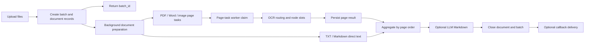

# DocLens Java

[中文](README.md)

DocLens Java is an OCR SDK, Spring Boot Starter, and standalone HTTP service for
batch document parsing. It is built with Java 21, Spring Boot 3, Maven modules,
and DDD boundaries. The system separates upload intake, document preparation,
page-level OCR, node routing, LLM Markdown post-processing, result query, and
callback delivery into observable and recoverable stages.

DocLens can be used in three ways:

- Run it as a standalone service and submit files through `/api/v1/**`.
- Embed it in a host Spring Boot application through the Starter.
- Use it as an OCR backend for OpenWebUI or other upstream systems through the
  integration API and metadata contract.

## Current Capabilities

| Capability | Description |
| --- | --- |
| Batch upload | Up to 30 files per batch and 500 MB total size, with frontend pre-checks and backend multipart protection |
| File types | Markdown/TXT direct text extraction; image/TIFF OCR; PDF rendered page by page; Word converted to PDF through LibreOffice |
| Async processing | Upload requests persist the batch and return quickly; background workers continue the slow work |
| Page-level OCR | PDF/Word/image inputs become durable page tasks that can run, retry, recover, and aggregate by page |
| OCR routing | Default mode is `GLOBAL_LOAD_BALANCE`; default strategy is `weighted-idle` |
| Node governance | OCR nodes support enable/disable, health checks, weight, max concurrency, circuit breaking, manual reconnect, and call history |
| Restart recovery | Startup recovery reschedules unfinished batches; expired page-task locks are completed or requeued based on persisted results |
| LLM Markdown | Runtime UI configuration, multiple-config round robin, per-config concurrency, paused passthrough, and chunk checkpoints |
| Dashboard | Batch, document, stage, callback, OCR resource, route hit, current allocation, and running page-task visibility |
| Callback delivery | Completed documents create durable callback jobs; failures keep reason/detail and retry within configured limits |

## Modules

| Module | Responsibility | Spring Web Dependency |
| --- | --- | --- |
| `doclens-api` | Public SDK contracts: `DocLensEngine`, DTOs, event SPI, adapter capability model | No |
| `doclens-core` | DDD domain model, use cases, query services, OCR routing, default engine implementation | No |
| `doclens-spring-boot-starter` | Auto-configuration, MyBatis-Plus repositories, Flyway, thread pools, local storage, OCR/LLM/callback infrastructure | No |
| `doclens-server` | REST controllers, Actuator, static Dashboard, standalone service entry point | Yes |
| `doclens-dashboard` | Vue 3 and TypeScript console | Frontend app |

## Quick Start

Recommended local workflow:

```bash
./scripts/dev-up.sh
./scripts/dev-status.sh
./scripts/dev-restart.sh
./scripts/dev-down.sh
```

Backend only:

```bash
mvn -pl doclens-server spring-boot:run
```

Default URLs:

- Dashboard: `http://127.0.0.1:10002/dashboard/`
- Backend: `http://127.0.0.1:10003`
- Actuator health: `http://127.0.0.1:10003/actuator/health`
- DocLens health: `http://127.0.0.1:10003/api/v1/health`

Create an OCR batch:

```bash
curl -X POST http://localhost:10003/api/v1/batches \
  -F 'files=@demo.pdf' \
  -F 'metadata={"bizId":"A-1001","source":"curl"}' \
  -F 'idempotency_key=idem-demo-001' \
  -F 'pdf_mode=page_image_fallback' \
  -F 'ocrRoutingMode=GLOBAL_LOAD_BALANCE' \
  -F 'ocrLoadBalanceStrategy=weighted-idle'
```

## Processing Pipeline



Important details:

- Upload does not wait for slow OCR calls.
- The document preparation pool defaults to concurrency `6`.
- Page-task execution concurrency is derived from the sum of configured OCR node
  `maxConcurrency` values first; configuration-file defaults are used only when
  runtime/page configuration cannot provide a value.
- Each OCR node has its own `maxConcurrency` slots. Requests without a free slot
  wait in the OCR pending queue.
- The Dashboard shows current document allocation and running OCR image tasks,
  including node, worker, thread, and elapsed time.

## Concurrency And Load Balancing

DocLens concurrency is layered:

| Layer | Control | Purpose |
| --- | --- | --- |
| Upload intake | 30 files / 500 MB | Prevent very large multipart requests from overwhelming the entry point |
| Document preparation | `documentProcessingExecutor` | Control PDF rendering, Word conversion, and image preparation pressure |
| Page scheduling | `ocr_document_page_tasks` | Make page-level parallelism, retry, and recovery durable |
| Page execution | `doclensPageTaskExecutor` | Follow OCR node capacity so multiple images can run concurrently |
| OCR node | Node `maxConcurrency` | Protect each downstream OCR service |
| LLM Markdown | Config `maxConcurrency` and chunk executor | Keep Markdown post-processing separate from OCR scheduling |

The default OCR routing mode is `GLOBAL_LOAD_BALANCE`, with `weighted-idle` as
the default strategy. Routing considers whether a node is enabled, healthy,
participates in global scheduling, has free slots, and how it is weighted. A
specific-node route does not silently fail over unless
`doclens.ocr.specific-node-fallback-enabled` is enabled.

## Crash Recovery And Data Safety

DocLens persists the important progress markers:

- Batch and document records are durable before upload acknowledgement.
- Startup recovery reschedules unfinished batches.
- Page-task workers write `locked_by` and `locked_until` when claiming work.
- If the process exits during OCR, expired `PROCESSING` page tasks are recovered:
  tasks with existing page results are completed, and tasks without results are
  returned to `QUEUED`.
- Page results are protected by `(document_id, page_no)` uniqueness and upsert
  semantics.
- Large LLM Markdown jobs write chunk checkpoints to
  `llm-markdown-chunks/<documentId>/<chunkNo>/README.md`, with `manifest.json`
  and `meta.json` validation. Completed chunks are reused after restart instead
  of being processed again.

## LLM Markdown

LLM Markdown is a post-OCR stage. OCR text remains available even when LLM is not
usable:

- UI/runtime configuration takes precedence.
- Only complete, enabled, and healthy configurations are selected.
- Multiple available configurations are selected by stable round robin.
- Paused configurations produce OCR passthrough with `llm_markdown_paused`.
- Missing usable configuration produces OCR passthrough with
  `no_available_llm_config`.
- API keys are not stored directly in configuration records. Records store
  environment variable names, and the service process reads the real secrets.

## Documentation

- [HTTP API Reference](docs/api.md): batches, documents, results, events,
  dashboard, OCR nodes, LLM Markdown, and OpenWebUI integration endpoints.
- [SDK Usage](docs/sdk.md): embedded Spring Boot Starter usage and pure Java SDK
  boundaries.
- [Configuration](docs/configuration.md): `doclens.*` properties, secret
  environment variables, OCR/LLM/document processing settings.
- [Local Development](docs/development.md): scripts, ports, logs, tests, and
  build commands.
- [Technical Delivery](docs/technical-delivery.md): architecture, concurrency,
  high availability, recovery, checkpoints, observability, and tuning.
- [Quick Trial](docs/quick-trial.md): five-minute local trial path.
- [Packaging Guide](docs/packaging_en.md): Maven packaging for SDK, Starter, and
  HTTP service artifacts.
- [OpenWebUI OCR Contract](docs/integrations/open-webui-ocr-contract.md):
  OpenWebUI-specific endpoints, authorization, and metadata conventions.

## Tech Stack

- Java 21
- Spring Boot 3.5.x
- Maven multi-module build
- MyBatis-Plus
- Flyway
- PostgreSQL for local, test, and production runtime
- Vue 3, TypeScript, Vite, Naive UI, and ECharts

## Verification

```bash
mvn test -q
./scripts/test-dev-scripts.sh
cd doclens-dashboard && npm test
```
