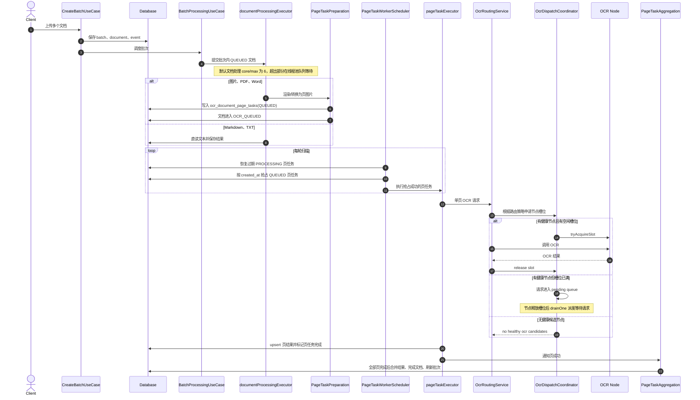

# DocLens Java

[English](README-en.md)

DocLens Java 是一个基于 Java 21、Spring Boot 3 和 DDD 边界设计的 OCR
SDK 与 HTTP 服务。它既可以作为 Spring Boot Starter 嵌入宿主系统，也可以
作为独立服务通过 `/api/v1/**` 提供 OCR 批处理能力。

## 适用场景

- 批量上传 PDF、Word、图片、TIFF、Markdown 或 TXT，并统一产出文本结果。
- 将 OCR 能力嵌入现有 Java/Spring Boot 应用。
- 独立部署 OCR 服务，再通过 HTTP API 被业务系统或 OpenWebUI 调用。
- 管理多个 OCR 节点、路由策略、健康状态和 LLM Markdown 后处理配置。

## 模块结构

| 模块 | 职责 | Spring Web 依赖 |
| --- | --- | --- |
| `doclens-api` | 对外 SDK 契约：`DocLensEngine`、DTO、事件 SPI、适配器能力模型 | 否 |
| `doclens-core` | DDD 领域模型、用例、查询服务、默认引擎实现 | 否 |
| `doclens-spring-boot-starter` | Spring Boot 自动装配、MyBatis-Plus 仓储、Flyway、事务、本地存储、默认 OCR 适配器 | 否 |
| `doclens-server` | HTTP 启动类、REST Controller、Actuator 与静态控制台入口 | 是 |

## 快速开始

启动 HTTP 服务：

```bash
mvn -pl doclens-server spring-boot:run
```

推荐的本地开发启动方式：

```bash
./scripts/dev-up.sh
./scripts/dev-status.sh
./scripts/dev-restart.sh
./scripts/dev-down.sh
```

- 控制台地址：`http://127.0.0.1:10002/dashboard/`
- 后端地址：`http://127.0.0.1:10003`
- Actuator 健康检查：`http://127.0.0.1:10003/actuator/health`
- DocLens API 健康检查：`http://127.0.0.1:10003/api/v1/health`

提交一个 OCR 批次：

```bash
curl -X POST http://localhost:10003/api/v1/batches \
  -F 'files=@demo.pdf' \
  -F 'metadata={"bizId":"A-1001","source":"curl"}' \
  -F 'idempotency_key=idem-demo-001' \
  -F 'pdf_mode=page_image_fallback'
```

## 文档导航

- [HTTP API 参考](docs/api.md)：批次、文档、结果、事件、Dashboard、OCR 节点、LLM Markdown 与 OpenWebUI 集成接口。
- [SDK 使用](docs/sdk.md)：Spring Boot Starter 嵌入式接入与纯 Java SDK 边界。
- [配置说明](docs/configuration.md)：`doclens.*` 配置项、密钥环境变量、OCR/LLM/文档处理参数。
- [本地开发](docs/development.md)：开发脚本、端口、日志、测试和构建命令。
- [打包指南](docs/packaging.md)：SDK、Starter 和 HTTP 服务的 Maven 打包方式。
- [OpenWebUI OCR 契约](docs/integrations/open-webui-ocr-contract.md)：OpenWebUI 专用接口、鉴权与 metadata 约定。

## 文档处理流水线

- Markdown/TXT：直接读取文本，不调用 OCR。
- Image/TIFF：调用 OCR 转文字。
- PDF：按页渲染为图片，并发 OCR 后按页码顺序合并文本。
- Word：先通过 LibreOffice 转 PDF，再复用 PDF 流程。
- LLM Markdown：可选后处理；未配置 LLM 时主流程仍返回 OCR 合并文本。

## 并发、负载均衡与容错治理

DocLens 把“上传接入”和“慢 OCR 执行”拆开处理。上传请求只在短事务中写入
`Batch`、`DocumentJob` 和事件记录；当 `doclens.auto-process-on-upload=true`
时，批次会被提交给进程内 worker。大量文档同时上传时，系统通过文档线程池、
页任务表、页任务 worker、OCR 节点槽位和 OCR pending queue 分层削峰。



### 并发分层

| 层级 | 作用 | 等待位置 |
| --- | --- | --- |
| 上传事务 | 快速落库，避免 HTTP 请求持有 OCR 长任务 | 无；只写 batch/document/event |
| `documentProcessingExecutor` | 并发准备批次内文档，默认 core/max 为 `6` | Java 线程池队列，默认容量 `1000` |
| `ocr_document_page_tasks` | 将 PDF/Word/图片拆成可恢复的页级 OCR 任务 | 数据库 `QUEUED` 状态 |
| `PageTaskWorkerScheduler` | 周期扫描并抢占页任务，默认约每 `500ms` 一轮 | 下一轮扫描 |
| `pageTaskExecutor` | 执行已抢占的单页 OCR | 页任务执行线程池队列 |
| OCR 节点槽位 | 按节点 `maxConcurrency` 限制真实 OCR 并发 | `OcrDispatchCoordinator` pending queue |
| LLM Markdown chunk | OCR 后的大文本 Markdown 分片处理 | 独立 chunk executor |

如果一次上传 10 个文档，默认最多 6 个文档先进入文档准备线程，剩余文档在
`documentProcessingExecutor` 队列等待。PDF、Word 和图片文档会被拆成页任务；
真正并发调用 OCR 的数量还要受页任务 worker、`pageTaskExecutor`、OCR 请求线程池
和每个 OCR 节点 `maxConcurrency` 共同限制。未抢占的页任务留在数据库 `QUEUED`，
抢占后但节点槽位不足的请求进入 OCR pending queue。

### OCR 负载均衡

- 默认路由模式是 `GLOBAL_LOAD_BALANCE`，只选择启用、健康、参与全局调度的节点。
- 默认策略是 `weighted-idle`：同时考虑节点空闲槽位比例和配置权重，避免所有请求压到同一个节点。
- 也支持按模型负载均衡和指定节点路由；指定节点失败时是否允许回退由
  `doclens.ocr.specific-node-fallback-enabled` 控制。
- `OcrDispatchCoordinator` 先尝试原子占用节点 slot；占用失败会尝试其他候选节点。
- 节点完成或失败后都会释放 slot，并触发一次 pending queue 派发。

### 熔断、重试与恢复

| 机制 | 行为 |
| --- | --- |
| OCR 请求重试 | `doclens.ocr.request-retry-times` 控制同一节点上的请求尝试次数，默认 `3` |
| 故障转移 | 当前节点多次失败后，允许从候选集中排除该节点并选择其他健康节点 |
| 健康探测 | OCR health worker 周期探测节点，失败次数达到阈值后打开熔断 |
| 熔断窗口 | 熔断期间节点不会进入候选集，默认打开时长由 `doclens.ocr.circuit-open-seconds` 控制 |
| 恢复判定 | 熔断节点需要连续成功达到 `recovery-success-threshold` 后恢复可调度 |
| 页任务锁 | worker 抢占页任务时写入 `locked_by` 和 `locked_until`，避免多 worker 同时消费 |
| 过期恢复 | 每轮扫描先恢复过期 `PROCESSING` 页任务；已有页结果则补完成，否则回到 `QUEUED` 重试 |

### 防重复解析与重复消费

- 页任务表用唯一约束 `(document_id, page_no)` 防止同一文档同一页重复建任务。
- 页结果表同样用 `(document_id, page_no)` 唯一约束，并通过 upsert 保存页结果。
- worker 通过条件更新把 `QUEUED` 原子改为 `PROCESSING`，只有抢占成功的线程执行 OCR。
- 页任务完成时校验 worker 归属，状态不匹配会失败而不是静默覆盖。
- 文档聚合发现文档已完成时，会跳过重复页成功回调。
- 批次级 `idempotency_key` 会透传到批次记录和查询接口，用于调用方对账；DocLens 不用它拒绝重复上传。

更细的配置项见 [配置说明](docs/configuration.md)。

## 技术栈

- Java 21
- Spring Boot 3.5.x
- Maven 多模块
- MyBatis-Plus
- Flyway
- H2 本地/测试数据库
- PostgreSQL 运行时依赖
- Vue 3、TypeScript、Vite、Naive UI、ECharts 控制台

## 验证

```bash
mvn test -q
./scripts/test-dev-scripts.sh
```
