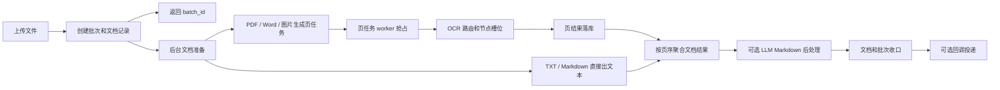

# DocLens Java

[English](README-en.md)

DocLens Java 是一个面向批量文档解析的 OCR SDK、Spring Boot Starter 和
独立 HTTP 服务。它基于 Java 21、Spring Boot 3、Maven 多模块和 DDD 边界构建，
把上传接入、文档准备、页级 OCR、节点路由、LLM Markdown 后处理、结果查询和回调交付拆成可治理的工程链路。

它适合三类使用方式：

- 作为独立服务部署，通过 `/api/v1/**` 接收 PDF、Word、图片、TIFF、Markdown、TXT 等文件并异步产出结果。
- 作为 Spring Boot Starter 嵌入宿主系统，复用 DocLens 的领域用例、仓储、线程池和 OCR 治理能力。
- 作为 OpenWebUI 或其他上游系统的 OCR 后端，通过专用集成接口、鉴权和 metadata 约定接入。

## 当前能力

| 能力 | 说明 |
| --- | --- |
| 批量上传 | 单批最多 30 个文件，总大小最多 500 MB；前端预检，后端 multipart 限制兜底 |
| 文档类型 | Markdown/TXT 直接读取；图片/TIFF OCR；PDF 按页渲染 OCR；Word 先经 LibreOffice 转 PDF |
| 异步处理 | 上传请求只完成校验、存储和落库，后台 worker 继续处理 |
| 页级 OCR | PDF/Word/图片拆成持久化页任务，按页并发、按页恢复、按页聚合 |
| OCR 路由 | 默认 `GLOBAL_LOAD_BALANCE`，策略为 `weighted-idle`，优先使用全局负载均衡 |
| 节点治理 | OCR 节点支持启停、健康检查、权重、最大并发、熔断、手动重连和调用记录 |
| 宕机恢复 | 服务启动后恢复未完成批次，过期页任务会根据页结果存在与否补完成或重新入队 |
| LLM Markdown | 运行时配置可从页面维护；支持多配置轮询、配置级并发、暂停直通和大文本 chunk checkpoint |
| Dashboard | 展示批次、文档、阶段、回调、OCR 资源、路由命中、当前文件实际分配和运行中图片页任务 |
| 回调交付 | 文档完成后创建持久化回调任务，失败记录原因并按上限重试 |

## 模块结构

| 模块 | 职责 | Spring Web 依赖 |
| --- | --- | --- |
| `doclens-api` | 对外 SDK 契约：`DocLensEngine`、DTO、事件 SPI、适配器能力模型 | 否 |
| `doclens-core` | DDD 领域模型、用例、查询服务、OCR 路由和默认引擎实现 | 否 |
| `doclens-spring-boot-starter` | 自动装配、MyBatis-Plus 仓储、Flyway、线程池、本地存储、OCR/LLM/回调基础设施 | 否 |
| `doclens-server` | REST Controller、Actuator、静态 Dashboard 和独立服务启动类 | 是 |
| `doclens-dashboard` | Vue 3 + TypeScript 控制台 | 前端应用 |

## 快速开始

推荐本地开发启动：

```bash
./scripts/dev-up.sh
./scripts/dev-status.sh
./scripts/dev-restart.sh
./scripts/dev-down.sh
```

也可以只启动后端：

```bash
mvn -pl doclens-server spring-boot:run
```

默认地址：

- Dashboard：`http://127.0.0.1:10002/dashboard/`
- Backend：`http://127.0.0.1:10003`
- Actuator 健康检查：`http://127.0.0.1:10003/actuator/health`
- DocLens 健康检查：`http://127.0.0.1:10003/api/v1/health`

提交一个 OCR 批次：

```bash
curl -X POST http://localhost:10003/api/v1/batches \
  -F 'files=@demo.pdf' \
  -F 'metadata={"bizId":"A-1001","source":"curl"}' \
  -F 'idempotency_key=idem-demo-001' \
  -F 'pdf_mode=page_image_fallback' \
  -F 'ocrRoutingMode=GLOBAL_LOAD_BALANCE' \
  -F 'ocrLoadBalanceStrategy=weighted-idle'
```

## 处理流水线



关键点：

- 上传阶段不等待慢 OCR，请求返回后后台继续处理。
- 文档准备线程池默认并发为 6。
- 页任务 worker 的执行并发优先按已配置 OCR 节点的 `maxConcurrency` 总和派生；没有页面/节点配置时才回落到配置文件默认。
- 每个 OCR 节点有自己的 `maxConcurrency` 槽位；没有槽位的请求进入 pending queue。
- Dashboard 的“当前文件实际分配”和“实时 OCR 图片任务”可以看到图片页被哪个节点、worker、线程消费。

## 并发与负载均衡

DocLens 的并发不是一个单独数字，而是多层容量控制：

| 层级 | 控制点 | 作用 |
| --- | --- | --- |
| 上传接入 | 30 个文件 / 500 MB | 防止超大 multipart 请求拖垮入口 |
| 文档准备 | `documentProcessingExecutor` | 控制 PDF 渲染、Word 转换、图片准备等 CPU/IO 压力 |
| 页任务调度 | `ocr_document_page_tasks` | 让多页文档可以按页并发、按页重试、按页恢复 |
| 页任务执行 | `doclensPageTaskExecutor` | 默认跟随 OCR 节点总并发，避免只跑少量图片 |
| OCR 节点 | 节点 `maxConcurrency` | 限制单个 OCR 服务真实并发 |
| LLM Markdown | 配置级 `maxConcurrency` 和 chunk executor | 避免 Markdown 后处理阻塞 OCR 主链路 |

默认路由模式是 `GLOBAL_LOAD_BALANCE`，默认策略是 `weighted-idle`。调度时会综合节点启用状态、健康状态、
是否参与全局调度、空闲槽位、权重和指定模型/指定节点策略。指定节点模式默认不自动回退到其他节点，
除非开启 `doclens.ocr.specific-node-fallback-enabled`。

## 宕机恢复和数据不丢

DocLens 把关键进度持久化到数据库或磁盘：

- 批次和文档记录落库后，服务启动时会重新调度仍未完成的批次。
- PDF/Word/图片会生成页任务；worker 抢占任务时写入 `locked_by` 和 `locked_until`。
- 进程在 OCR 中途退出后，过期 `PROCESSING` 页任务会被恢复：页结果已存在则补为完成，页结果不存在则回到 `QUEUED`。
- 页结果以 `(document_id, page_no)` 唯一约束和 upsert 防重复。
- LLM Markdown 大文本按 chunk 处理，chunk 输出会落到 `llm-markdown-chunks/<documentId>/<chunkNo>/README.md`，并带 `manifest.json` 和 `meta.json` 校验。重启后已完成 chunk 会复用，不再重复调用 LLM。

## LLM Markdown

LLM Markdown 是 OCR 后处理阶段，不影响 OCR 原文产出：

- 页面配置优先；配置完整、启用、健康的 LLM 配置才会被选择。
- 多个可用配置按用途和优先级稳定轮询。
- 配置被暂停时返回 OCR 原文，并标记为 `llm_markdown_paused`。
- 没有可用配置时返回 OCR 原文，并标记为 `no_available_llm_config`。
- API Key 不直接存储在配置记录里，配置保存环境变量名，真实密钥由服务进程环境变量读取。

## 文档导航

- [HTTP API 参考](docs/api.md)：批次、文档、结果、事件、Dashboard、OCR 节点、LLM Markdown、OpenWebUI 集成接口。
- [SDK 使用](docs/sdk.md)：Spring Boot Starter 嵌入式接入与纯 Java SDK 边界。
- [配置说明](docs/configuration.md)：`doclens.*` 配置项、密钥环境变量、OCR/LLM/文档处理参数。
- [本地开发](docs/development.md)：开发脚本、端口、日志、测试和构建命令。
- [技术交付文档](docs/technical-delivery.md)：架构、并发、高可用、恢复、checkpoint、观测和调优。
- [快速试用](docs/quick-trial.md)：五分钟本地体验路径。
- [打包指南](docs/packaging.md)：SDK、Starter 和 HTTP 服务的 Maven 打包方式。
- [OpenWebUI OCR 契约](docs/integrations/open-webui-ocr-contract.md)：OpenWebUI 专用接口、鉴权与 metadata 约定。

## 技术栈

- Java 21
- Spring Boot 3.5.x
- Maven 多模块
- MyBatis-Plus
- Flyway
- PostgreSQL 本地/测试/生产数据库
- Vue 3、TypeScript、Vite、Naive UI、ECharts

## 验证

```bash
mvn test -q
./scripts/test-dev-scripts.sh
cd doclens-dashboard && npm test
```
