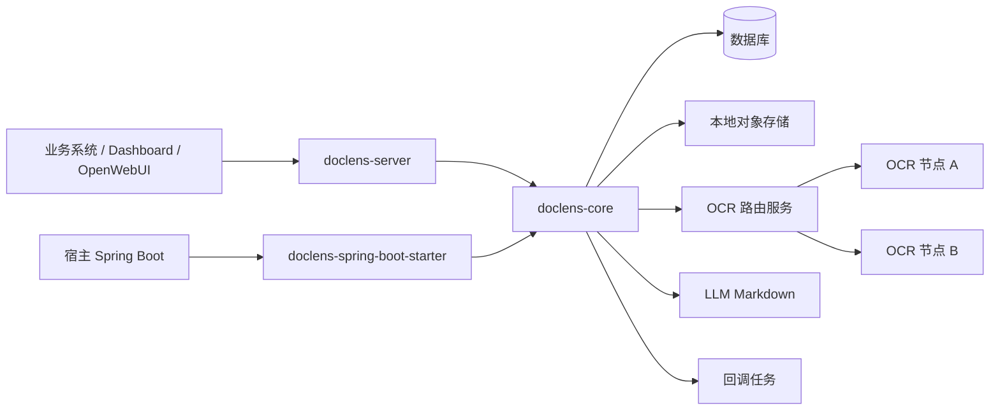
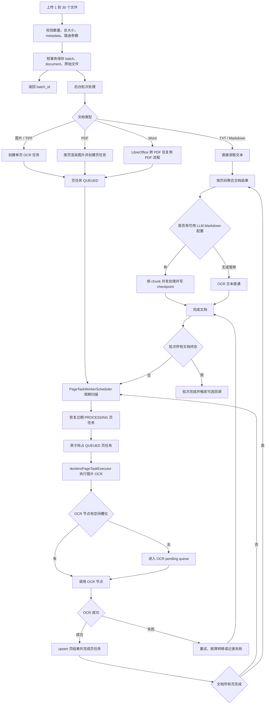

# DocLens-j 技术交付文档

## 交付定位

DocLens-j 交付的是一套文档解析基础设施，不是单次 OCR 调用示例。它面向批量上传、异步处理、
OCR 节点治理、LLM Markdown 后处理、结果查询、回调交付和运行诊断，支持两种交付形态：

- 嵌入式：通过 `doclens-spring-boot-starter` 接入宿主 Spring Boot 应用。
- 独立式：运行 `doclens-server`，通过 HTTP API 和 Dashboard 提供服务。

设计目标是让慢 OCR、慢 LLM、下游回调失败和服务重启都不会把上传入口拖垮。系统优先保证任务可恢复、
状态可解释、容量可调优，然后再通过节点并发和负载均衡提升吞吐。

## 架构边界

| 模块 | 交付职责 | 边界 |
| --- | --- | --- |
| `doclens-api` | SDK 契约、DTO、事件 SPI、适配器能力模型 | 不依赖 Spring Web |
| `doclens-core` | 领域模型、批次/文档/页任务用例、查询服务、OCR 路由编排 | 不依赖 Servlet 和 MyBatis |
| `doclens-spring-boot-starter` | 自动装配、仓储、Flyway、线程池、本地存储、OCR/LLM/回调基础设施 | 承接可替换基础设施 |
| `doclens-server` | REST API、Actuator、Dashboard 静态入口 | 只做协议适配和启动 |
| `doclens-dashboard` | 运维控制台 | 通过 `/api/v1/**` 查询和操作 |



## 端到端处理链路



## 三高保障体系

| 目标 | 实现机制 | 取舍 |
| --- | --- | --- |
| 高并发 | 上传短事务、文档准备线程池、页任务表、页任务 worker、OCR 节点槽位、LLM chunk executor | 不追求同步完成，优先释放 HTTP 线程 |
| 高可用 | 批次启动恢复、页任务过期锁恢复、页结果 upsert、OCR 健康检查、熔断、回调重试 | 允许后台补偿，换取任务不丢和状态可解释 |
| 高性能 | 默认全局负载均衡、`weighted-idle`、节点 `maxConcurrency`、线程池隔离、配置级 LLM 并发 | 不简单放大线程，按真实瓶颈分层限流 |

高并发靠分层削峰。上传入口只做必要校验和落库；文档准备默认并发为 6；PDF/Word/图片再拆成页任务；
页任务执行并发优先按 OCR 节点总并发派生；每个 OCR 节点再用自己的 `maxConcurrency` 保护下游。

高可用靠持久化进度。批次、文档、页任务、页结果、回调任务都可查询；进程重启后恢复服务会重新调度未完成批次；
页任务锁过期后会判断页结果是否存在，存在则补完成，不存在则重新排队。

高性能靠容量匹配。OCR 调度默认不是固定两个请求慢慢跑，而是优先使用页面/节点配置派生出的总并发。
如果配置了 3 个 OCR 节点且每个 `maxConcurrency=10`，页任务执行池会优先按 30 的容量补位；
每个节点内部仍按自身槽位控制真实下游压力。

## 并发层级

| 层级 | 当前机制 | 默认或来源 | 观测方式 |
| --- | --- | --- | --- |
| 上传入口 | 文件数量和体积限制 | 前端 30 个文件 / 500 MB，后端 500 MB multipart | 上传页错误提示、HTTP `413` detail |
| 文档准备 | `documentProcessingExecutor` | 默认 6 | Dashboard 线程池指标 |
| 页任务扫描 | `PageTaskWorkerScheduler` | 默认 500ms 间隔 | Dashboard worker 设置和页任务状态 |
| 页任务执行 | `doclensPageTaskExecutor` | 页面/节点 OCR 总并发优先，配置文件兜底 | Dashboard 实时 OCR 图片任务 |
| OCR 节点 | 节点 `maxConcurrency` | OCR 节点页面配置或启动节点配置 | OCR 资源页、批次 OCR 路由面板 |
| OCR 请求线程 | `doclens-ocr-request-*` | 默认 core 2 / max 4 | 线程池指标 |
| LLM chunk | `doclensLlmMarkdownChunkExecutor` | LLM 运行时配置和线程池 | 文档结果 LLM 状态、线程池指标 |
| 回调 | callback 线程池和回调任务表 | 默认并发 3、重试 3 次 | 批次详情 callback_jobs |

调优原则是先看瓶颈在哪一层，再调整对应配置。直接把所有线程池调大，可能只会把压力转移到 OCR 服务、
数据库连接、LLM 服务或回调目标。

## OCR 路由和负载均衡

默认路由模式是 `GLOBAL_LOAD_BALANCE`，默认策略是 `weighted-idle`。上传页也默认选择全局负载均衡。

路由决策会考虑：

- 节点是否启用；
- 节点健康状态和熔断状态；
- 节点是否参与全局调度；
- 当前 `inflightImages`、`queuedImages`、`availableSlots`；
- 节点权重；
- 上传时是否指定模型或指定节点；
- 指定节点失败后是否允许 fallback。

`weighted-idle` 适合大部分通用吞吐场景。指定模型适合不同 OCR 模型能力不同的场景。指定节点适合灰度、
调试或专用资源；默认不自动回退，避免用户选择的专用节点被静默替换。

## 宕机恢复

DocLens 的恢复分为批次恢复和页任务恢复。

批次恢复发生在服务启动后。系统会扫描仍未终态的批次和文档，重新进入后台处理。这样上传完成但服务马上重启时，
批次不会长期停在等待状态。

页任务恢复发生在 worker 每轮扫描前。worker 抢占页任务时写入 `locked_by` 和 `locked_until`：

- `locked_until` 未过期时，其他 worker 不会重复消费。
- `locked_until` 过期后，恢复服务会检查同一 `document_id + page_no` 是否已有页结果。
- 已有页结果：把页任务补成 `COMPLETED`，继续触发文档聚合。
- 没有页结果：清理锁并回到 `QUEUED`，等待重新执行 OCR。

这个设计避免了“重启后整篇文档从头解析”的问题。OCR 页结果已经落库的页不会重复产生结果；
没有完成的页可以重新分配给任意健康 OCR 节点。

## LLM Markdown chunk checkpoint

LLM Markdown 是 OCR 完成后的可选后处理。大文本会按 chunk 拆分，并行提交到 chunk executor。
为了避免服务在第 90 个 chunk 左右宕机后从头调用 LLM，系统会把每个已完成 chunk 持久化到磁盘：

```text
<storage-root>/llm-markdown-chunks/<documentId>/
  manifest.json
  01/
    README.md
    meta.json
  02/
    README.md
    meta.json
```

恢复时会校验：

- `manifest.json` 的 `documentId`、`chunkCount`、`planFingerprint` 是否匹配当前计划；
- `meta.json` 的 chunk 编号和 `README.md` 的 SHA-256 是否匹配；
- `README.md` 是否存在且非空。

校验通过的 chunk 会直接复用，未完成或校验失败的 chunk 才会重新处理。checkpoint 写入使用临时文件和原子移动，
尽量保证文件完整性，同时写入动作通过独立 executor 参与调度，避免把所有性能成本压到主流程。

## LLM 配置优先级和直通语义

LLM Markdown 配置由页面和 API 管理。运行时选择逻辑是：

- 只选择配置完整、启用、可用于 Markdown 后处理的配置。
- 多个可用配置按用途、优先级和 ID 稳定轮询。
- 配置级 `maxConcurrency` 控制同一 LLM 配置的并发请求数。
- 所有完整配置都暂停时，结果直通 OCR 原文并标记 `llm_markdown_paused`。
- 没有可用配置时，结果直通 OCR 原文并标记 `no_available_llm_config`。
- 配置记录保存环境变量名；真实密钥必须存在于服务进程环境变量中。

这意味着 LLM 失败或暂停不会让 OCR 主结果消失。用户仍可以在结果抽屉看到 OCR 原文、Markdown 主结果、
LLM 状态和友好失败原因。

## 上传限制和失败语义

上传限制在两层生效：

| 层级 | 限制 | 用户反馈 |
| --- | --- | --- |
| Dashboard | 单批最多 30 个文件，总大小最多 500 MB | 阻止提交并提示拆分上传 |
| Server | multipart `max-file-size=500MB`、`max-request-size=500MB` | 返回 `413` 和结构化 `detail` |

服务端还会校验 `files` 必填、`callback_url` 必须是 HTTP/HTTPS URL、metadata 必须能解析为 JSON。
失败响应优先返回 `detail`，Dashboard 会直接展示该 detail，而不是只显示模糊的 HTTP 状态。

## 幂等和防重复消费

| 场景 | 机制 |
| --- | --- |
| 调用方对账 | `idempotency_key` 作为透传关联键，不阻止重复上传 |
| 页任务创建 | 同一文档同一页只能有一条页任务 |
| 页结果保存 | `(document_id, page_no)` 唯一约束和 upsert |
| worker 抢占 | 条件更新 `QUEUED -> PROCESSING` |
| 过期 worker | 校验锁归属和状态后才完成任务 |
| 文档聚合 | 文档已终态时跳过重复收口 |
| checkpoint | manifest、meta、chunk SHA-256 三重校验 |

批次级 `idempotency_key` 保持第三方对账语义。真正防重复消费依赖页任务状态机、数据库唯一约束和 checkpoint 校验。

## 可观测性

Dashboard 重点展示这些运维信号：

- 批次：总文件数、完成数、失败数、阶段、事件轨迹。
- 文档：处理阶段、页数、失败原因、结果下载、重试和删除。
- OCR 路由：上传策略、当前文件运行中分配、最终分配结果、批次级命中节点。
- 实时 OCR 图片任务：页码、OCR 节点、worker、线程名、运行耗时。
- OCR 资源：模型、节点、健康、最大并发、运行中、排队、平均耗时。
- 线程池：文档处理、页任务 OCR、OCR 请求、OCR 健康检查、LLM chunk、回调。
- 回调：状态、失败原因、失败详情、重试次数、手动重试。

定位慢批次时建议按顺序看：上传是否被限制、文档准备是否排队、页任务是否大量 `QUEUED`、
OCR 节点是否无空闲槽位、节点是否熔断、LLM chunk 是否积压、回调是否持续失败。

## 配置和运维入口

常用配置入口：

- OCR 默认路由：`doclens.ocr.default-routing-mode`
- OCR 策略：`doclens.ocr.load-balance-strategy`
- OCR 请求重试：`doclens.ocr.request-retry-times`
- 指定节点 fallback：`doclens.ocr.specific-node-fallback-enabled`
- 页任务 worker：`doclens.page-task-worker.*`
- 文档准备线程池：`doclens.thread-pools.document-processing-thread-pool.*`
- 回调：`doclens.callback.*`
- 存储根目录：`doclens.storage-root`

详细字段见 [配置说明](configuration.md)。HTTP 端点见 [HTTP API 参考](api.md)。

## 技术取舍

| 取舍 | 当前选择 | 原因 | 代价 |
| --- | --- | --- | --- |
| 上传是否同步 OCR | 不同步，返回 `batch_id` 后后台处理 | 释放 HTTP 线程，降低调用方超时风险 | 调用方需要查询或回调获取结果 |
| 页任务存储 | 数据库页任务表 | 可恢复、可查询、可幂等 | 数据库索引和扫描效率变重要 |
| OCR dispatch queue | 进程内 pending queue + 持久化页任务 | 延迟低，实现简单 | 多实例下 dispatch queue 本身不跨进程 |
| 调度粒度 | 按页调度 | 多页文档可以并行，失败页可恢复 | 聚合逻辑更复杂 |
| 负载均衡 | 全局负载均衡 + 加权空闲优先 | 同时考虑节点能力和实时空闲 | 需要维护健康、权重和并发配置 |
| LLM checkpoint | 磁盘 checkpoint | 宕机后复用已完成 chunk | 需要清理策略和存储容量治理 |
| 密钥管理 | 配置保存环境变量名 | 避免密钥落库 | 部署时必须保证进程环境变量完整 |

## 后续演进边界

当前交付已经覆盖单服务和轻量多实例场景下的批量 OCR、恢复、负载均衡和可观测性。更高规模场景可以继续演进：

- 将页任务扫描迁移到持久化 MQ 或数据库 outbox。
- 引入跨实例 dispatch queue 和分布式节点槽位治理。
- 为 LLM checkpoint 增加自动清理和容量水位。
- 增加 OCR/LLM 质量评测和模型选择反馈。
- 将 Dashboard 的运行中任务扩展为历史时间线。

这些演进不改变当前核心原则：上传轻量化、任务持久化、OCR 按容量调度、异常可恢复、状态可解释。
