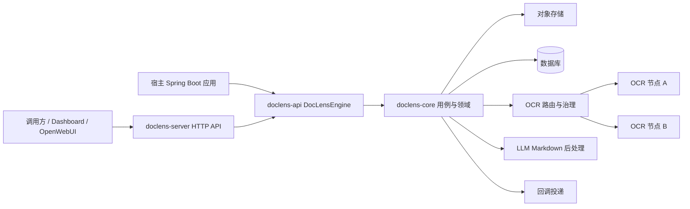
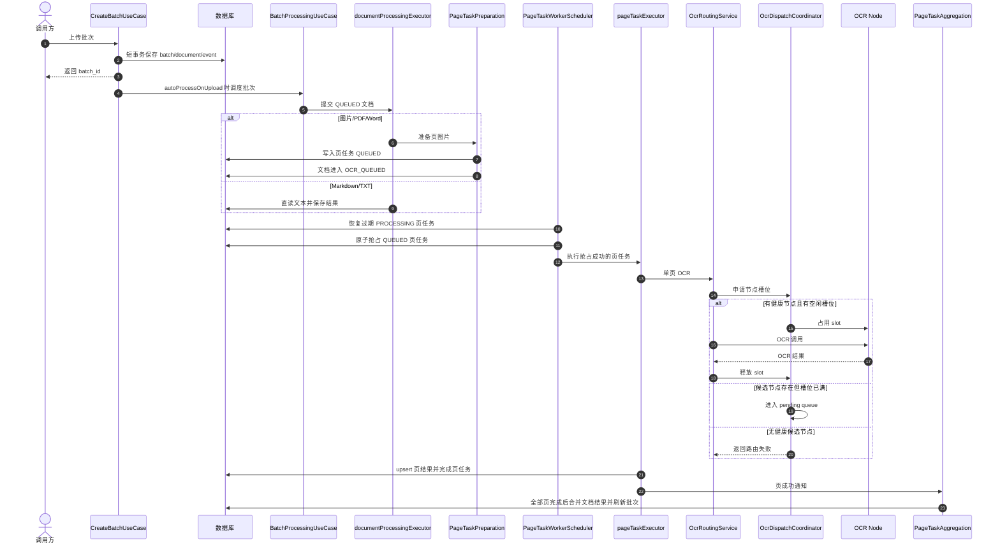

# DocLens-j 技术交付文档

## 交付定位

DocLens-j 交付的是一套文档解析基础设施，而不是单点 OCR 调用示例。它面向批量文档接入、
OCR/LLM 后处理、结果交付、调用归因和运行诊断，既可以作为 Spring Boot Starter 嵌入宿主系统，
也可以作为独立 HTTP 服务部署。

交付目标有三类：

| 目标 | 交付价值 | 技术体现 |
| --- | --- | --- |
| 稳定处理 | 大量文档上传时不把 HTTP 请求绑定到慢 OCR 调用 | 短事务落库、异步调度、页级任务队列 |
| 高可用运行 | 节点失败、进程重启、慢请求和重复回调不破坏主流程 | 健康探测、熔断、重试、过期锁恢复、幂等约束 |
| 可运营治理 | 能解释容量瓶颈、节点命中、失败原因和回调状态 | Dashboard 指标、事件轨迹、线程池与节点指标 |

## 总体架构

DocLens-j 使用四层模块边界控制复杂度：

| 模块 | 交付职责 | 技术边界 |
| --- | --- | --- |
| `doclens-api` | 对外 SDK 契约 | 不依赖 Spring Web，保持宿主系统可嵌入 |
| `doclens-core` | 领域模型、用例、查询和路由编排 | 不引入 MyBatis、Servlet 或 Web Controller |
| `doclens-spring-boot-starter` | 自动装配、仓储、Flyway、线程池、本地存储和适配器 | 承接基础设施替换点 |
| `doclens-server` | REST API、Actuator、Dashboard 静态入口 | Controller 只做协议适配 |

这个分层让交付有两个形态：业务系统可以直接嵌入 SDK，也可以把 DocLens-j 当作独立解析服务调用。
核心流程保持一致，部署形态不同不会拆散业务语义。

## 端到端处理链路

上传接口不等待 OCR 完成。它只负责校验文件、写入批次、文档和事件，然后把批次交给后台 worker。
慢任务被拆成文档任务和页任务，最终由 OCR 节点槽位承载真实解析压力。

## 并发处理能力

DocLens-j 的并发不是单一线程池，而是多层削峰：

| 层级 | 控制对象 | 等待位置 | 交付意义 |
| --- | --- | --- | --- |
| 上传接入 | HTTP 请求 | 无，快速返回 `batch_id` | 避免慢 OCR 持有请求线程 |
| 文档处理 | 批次内文档准备 | `documentProcessingExecutor` 队列 | 默认 core/max 为 `6`，控制批次内准备压力 |
| 页级任务 | PDF/Word/图片页 | `ocr_document_page_tasks` 的 `QUEUED` 状态 | 任务可恢复、可观察、可重试 |
| Worker 抢占 | 待执行页任务 | 下一轮扫描 | 用 `locked_by`/`locked_until` 防止多 worker 重复消费 |
| OCR 执行 | 单页 OCR 请求 | `pageTaskExecutor` 队列和 OCR pending queue | 本地执行池与远端节点容量分离 |
| 节点槽位 | OCR 节点真实并发 | `OcrDispatchCoordinator` pending queue | 按节点 `maxConcurrency` 控制下游压力 |
| LLM 分片 | OCR 后 Markdown 后处理 | 独立 chunk executor | 大文本后处理不阻塞页级 OCR 调度 |

例如一次上传 10 个多页 PDF，默认最多 6 个文档先进入文档准备线程，其余文档留在线程池队列。
每个 PDF 会拆出多条页任务；未被 worker 抢占的页任务保持 `QUEUED`，抢占后如果 OCR 节点槽位不足，
请求会进入 OCR pending queue。这样系统不会因为单个大批次把所有资源直接打满。

## 负载均衡能力

默认路由模式是 `GLOBAL_LOAD_BALANCE`，默认策略是 `weighted-idle`。它不是简单轮询，而是同时考虑：

- 节点是否启用、健康、参与全局调度。
- 节点当前 `inflightImages` 和 `availableSlots`。
- 节点配置权重。
- 路由策略是否指定模型或指定节点。

负载均衡的核心取舍是“利用率”和“隔离性”之间的平衡。全局负载均衡适合通用吞吐；指定模型路由适合
模型能力差异；指定节点适合灰度、调试或专用节点。指定节点失败后是否允许回退由
`doclens.ocr.specific-node-fallback-enabled` 控制，默认关闭，避免专用路由被静默转移到不符合预期的节点。

## 高可用设计

DocLens-j 的高可用由持久化任务、节点治理和恢复机制共同构成：

| 风险 | 设计 | 结果 |
| --- | --- | --- |
| 上传量突然增大 | 上传只落库，后续由多层队列消化 | 接口快速返回，后台逐步处理 |
| OCR 节点过载 | 节点 `maxConcurrency` 和 pending queue | 请求等待槽位，不无限打下游 |
| OCR 节点失败 | 请求重试、故障转移、健康探测 | 单节点异常不直接拖垮整个批次 |
| 节点持续失败 | failure threshold 后打开熔断 | 熔断节点不再进入候选集 |
| 进程在页任务中途退出 | `locked_until` 过期恢复 | 已落库结果补完成，未完成任务回队列 |
| 页结果重复写入 | `(document_id, page_no)` 唯一约束和 upsert | 重复执行不会产生重复页结果 |
| 文档重复聚合回调 | 文档完成后跳过重复页成功通知 | 已完成文档不会被重复收口 |

这套设计让系统具备“可恢复的最终完成”能力。它不承诺所有请求立即完成，而是优先保证任务不丢、节点不过载、
异常可恢复、状态可解释。

## 重试、熔断与恢复

OCR 请求的重试由 `doclens.ocr.request-retry-times` 控制，默认同一节点尝试 `3` 次。当前节点多次失败后，
路由层可以排除该节点并尝试其他健康候选节点。健康检查会持续更新节点状态，失败次数达到阈值后打开熔断；
熔断窗口内节点不参与调度，恢复需要连续成功达到 `recovery-success-threshold`。

页任务层的恢复更偏向数据一致性：worker 抢占任务时写入 `locked_by` 和 `locked_until`。每轮扫描先查找
过期 `PROCESSING` 任务；如果页结果已经存在，就把任务补成 `COMPLETED` 并触发聚合；如果页结果不存在，
就清理锁并回到 `QUEUED` 等待重新执行。

## 幂等与防重复消费

DocLens-j 对不同层次使用不同的幂等策略：

| 层级 | 机制 | 说明 |
| --- | --- | --- |
| 批次接入 | `idempotency_key` 透传和查询 | 用于调用方对账，不用于服务端拒绝重复上传 |
| 页任务创建 | `(document_id, page_no)` 唯一约束 | 同一文档同一页不能重复建任务 |
| 页结果保存 | `(document_id, page_no)` 唯一约束和 upsert | 重复页执行只更新同一页结果 |
| Worker 消费 | 条件更新 `QUEUED -> PROCESSING` | 只有抢占成功的 worker 执行 OCR |
| 页任务完成 | 校验 worker 归属和状态 | 避免过期 worker 覆盖新状态 |
| 文档聚合 | 已完成文档跳过重复成功通知 | 防止重复聚合和重复回调 |

这个设计避免把所有幂等问题都压到一个字段上。批次级 `idempotency_key` 保持对账语义，任务级和结果级
幂等由数据库约束与状态机承担。

## 技术取舍

| 取舍点 | 当前选择 | 原因 | 代价 |
| --- | --- | --- | --- |
| 上传是否同步 OCR | 不同步，只落库并调度 | 保护 HTTP 线程，降低调用方超时风险 | 调用方需要通过查询或回调获取结果 |
| 页任务存储 | 使用数据库页任务表 | 可恢复、可查询、可和业务事务对齐 | 吞吐上限受数据库和索引设计影响 |
| OCR dispatch queue | 使用进程内 pending queue | 实现简单，延迟低，适合单服务或轻量部署 | 多实例下需要依赖页任务层协调，dispatch queue 本身不跨实例 |
| 调度粒度 | 按页调度而不是整文档调度 | 多页文档可以并行，失败页可恢复 | 聚合逻辑更复杂 |
| 负载均衡 | 权重 + 空闲槽位 | 兼顾节点能力和实时压力 | 需要持续维护节点健康与权重 |
| 幂等语义 | 批次对账 + 页级硬约束 | 避免误把调用方 key 当作全局唯一业务事实 | 调用方仍需决定重复上传是否接受 |
| LLM Markdown | OCR 后独立分片处理 | 不阻塞 OCR 主链路，支持大文本 | LLM 质量和成本需要单独治理 |

这些选择的共同目标是：先保证工程可靠性和可解释性，再逐步增强吞吐上限。对于更高规模部署，可以继续演进为
持久化 MQ、分布式限流、跨实例 dispatch queue 和模型质量评测体系。

## 可观测性与运维

交付后的日常运维重点不是只看“批次成功/失败”，而是拆开看瓶颈在哪里：

- 批次维度：总文件数、完成数、失败数、阶段和事件轨迹。
- 文档维度：当前处理阶段、页数、失败原因、重试状态。
- OCR 节点维度：健康状态、命中次数、`inflightImages`、`queuedImages`、平均耗时。
- 线程池维度：文档处理、OCR 请求、OCR 健康检查、回调、LLM chunk executor 的活跃数和队列长度。
- 回调维度：投递状态、失败原因、失败详情、重试次数。

定位瓶颈时可以按顺序判断：文档线程池是否排队、页任务是否大量 `QUEUED`、OCR 节点是否无空闲槽位、
节点是否熔断、LLM chunk executor 是否积压、回调是否持续失败。

## 容量规划与调优建议

| 场景 | 关注参数 | 调优方向 |
| --- | --- | --- |
| 小文件高频上传 | `documentProcessingExecutor`、调用方限流 | 控制上传侧并发，避免批次过多导致队列抖动 |
| 多页 PDF | `pageTaskWorker.batchSize`、`pageTaskExecutor.poolSize`、节点 `maxConcurrency` | 让页任务扫描量、执行线程和节点槽位匹配 |
| OCR 节点能力不同 | 节点 weight、`maxConcurrency`、`weighted-idle` 因子 | 强节点给更高权重，弱节点限制并发 |
| 节点不稳定 | failure threshold、circuit open seconds、recovery success threshold | 更快摘除异常节点，避免反复打失败节点 |
| 大文本 Markdown | LLM chunk executor、LLM 配置并发、上下文窗口 | 控制 LLM 成本和超时风险 |
| 回调压力高 | callback 线程池、回调重试参数 | 避免下游回调失败拖慢主处理观测 |

调优原则是先找到最窄资源，再调整对应层级。直接把所有线程池调大通常不是最佳方案，因为 OCR 下游节点、
数据库连接、LLM 服务和回调目标都可能成为新的瓶颈。

## 交付边界与后续演进

当前交付重点是“可嵌入、可部署、可恢复、可诊断”的文档解析基础设施。它已经具备批量接入、页级调度、
OCR 节点治理、回调交付和 Dashboard 观测能力，但仍保留清晰边界：

- 不接管终端用户登录、组织、RBAC 或业务权限。
- 不把 `idempotency_key` 作为服务端重复上传拒绝机制。
- 不承诺固定吞吐数字，吞吐取决于 OCR 节点、数据库、线程池和部署资源。
- 多实例部署时，页任务数据库锁能协调任务消费，但进程内 OCR pending queue 不跨实例共享。

后续演进可以围绕四个方向推进：持久化消息队列、分布式限流与租户隔离、OCR/LLM 质量评测集、场景化模板和
结构化输出。这些能力应该在现有边界上增量建设，而不是牺牲当前交付的可解释性和可运维性。
